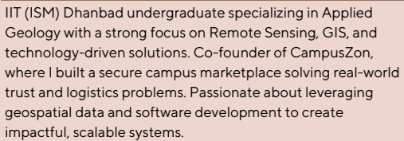

---
hide:
  - toc
  - navigation
---
<!--
CHECKLIST FOR THIS PAGE:
- [ ] Replace [YOUR NAME] with your full name (3 places)
- [ ] Replace [YOUR JOB TITLE] with your current or target role
- [ ] Replace [YOUR TAGLINE] with a short phrase describing your focus
- [ ] Rewrite the About Me paragraph with your own words
- [ ] Replace assets/images/profile.png with your actual photo (keep the filename or update it below)
- [ ] Replace assets/images/about.png with your own image (a field photo, map, or workspace shot)
- [ ] Edit the skill cards to match your actual skills (add, remove, or rename cards as needed)
- [ ] Update GitHub and LinkedIn links in the Connect section
- [ ] Add your CV PDF to docs/assets/ and update the filename in the Download CV button
-->

  
  <h1>Subham Sharma</h1>
  
<strong>Undergraduate at IIT(ISM) Dhanbad</strong>

  
<em>Remote Sensing • GIS • Geospatial Data Science • Python</em>

---

## About Me

I am an Integrated M.Tech student in Applied Geology at IIT (ISM) Dhanbad with interests in Remote Sensing, GIS, Geospatial Data Science, and software development. I work with satellite imagery, spatial data, and Python-based tools to develop data-driven solutions. Alongside geospatial technologies, I enjoy building software products such as CampusZon and cybersecurity-focused applications.

  

---

[View My Projects :material-arrow-right:](projects/index.md){ .md-button .md-button--primary }
[Download CV :material-download:](assets/Subham-Sharma-CV.pdf){ .md-button }

---

## Skills

## Skills

- :material-earth:{ .lg .middle } **GIS & Remote Sensing**

  ---

  - QGIS
  - Google Earth Engine
  - WebGIS Fundamentals
  - Satellite Image Analysis
  - Land Use & Land Cover Mapping

- :material-code-braces:{ .lg .middle } **Programming**

  ---

  - Python
  - C++
  - HTML & CSS
  - Data Structures & Algorithms
  - Git & GitHub

- :material-chart-line:{ .lg .middle } **Geospatial Data Science**

  ---

  - GeoPandas
  - NumPy
  - Pandas
  - Matplotlib
  - Spatial Data Processing

- :material-lock:{ .lg .middle } **Software & Security**

  ---

  - Cryptography
  - Secure Password Management
  - SQLite
  - Authentication Systems
  - Backend Development

- :material-rocket-launch:{ .lg .middle } **Projects & Entrepreneurship**

  ---

  - Startup Development
  - Product Design
  - CampusZon Marketplace
  - Team Collaboration
  - Problem Solving

- :material-account-group:{ .lg .middle } **Professional Skills**

  ---

  - Leadership
  - Communication
  - Event Management
  - Documentation
  - Content Writing

---

## Connect

[GitHub](https://github.com/SubSh2004){ .md-button }
[LinkedIn](https://www.linkedin.com/in/subham-venkateshwar-sharma-061b37320/){ .md-button }
