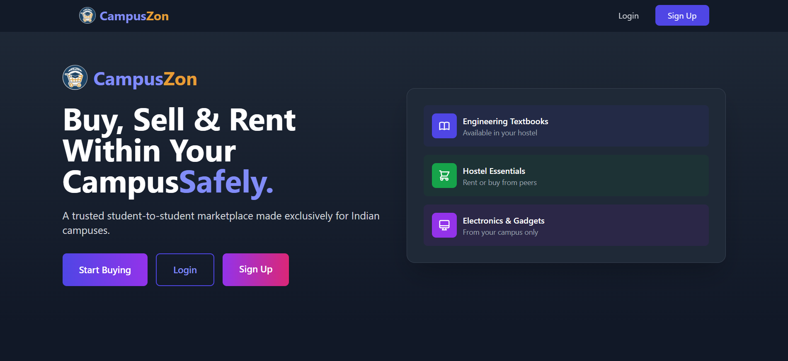

# CampusZon 🛒

## Overview

CampusZon is a full-stack marketplace platform designed exclusively for college students to buy, sell, and rent items within their campus community. The platform addresses common trust and logistics challenges in student marketplaces through campus email verification and secure user interactions.

---

## Problem Statement

Students often rely on fragmented social media groups and messaging platforms to exchange items, resulting in trust issues, poor discoverability, and inefficient communication.

CampusZon was developed to provide a dedicated, secure, and campus-focused marketplace experience.

---

## Key Features

* College email verification system
* Buy, sell, and rent item listings
* Real-time messaging using Socket.IO
* Item booking and reservation system
* Notification management dashboard
* Google OAuth authentication
* Dark mode support
* Campus-specific item filtering

---

## My Contributions

As Co-Founder and Lead Developer, I:

* Designed and developed the platform architecture
* Implemented authentication and authorization systems
* Built the marketplace listing and booking workflows
* Integrated real-time chat and notifications
* Managed backend APIs and database design
* Led deployment and production infrastructure

---

## Tech Stack

### Frontend

* React
* TypeScript
* Vite
* Tailwind CSS
* Recoil

### Backend

* Node.js
* Express.js
* Socket.IO

### Databases

* MongoDB
* PostgreSQL

### Deployment

* Vercel
* Render

---

## Impact

* Built for the IIT (ISM) student community
* Secure verification-based marketplace
* Supports buying, selling, and renting workflows
* Demonstrates full-stack development, database design, authentication, and real-time communication systems

---

## Project Links

**Website:**  [campuszon.tech](https://campuszon.tech)

**GitHub:** [ CampusZon](https://github.com/SubSh2004/CampusZon)

---

## Screenshots

