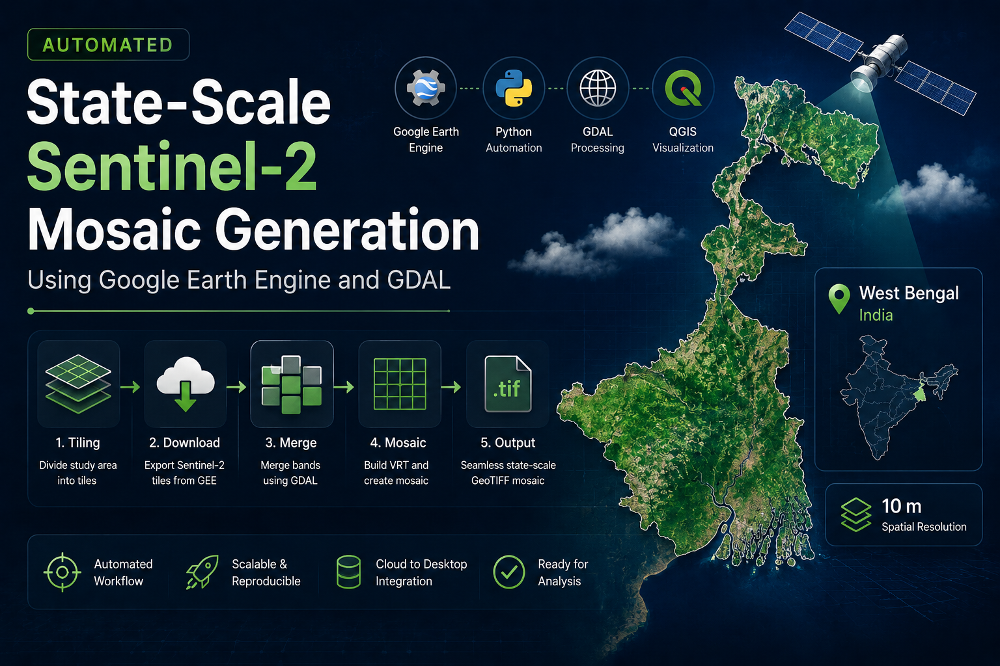

# Projects

A collection of projects spanning geospatial analysis, remote sensing, software development, and entrepreneurship.

**[CampusZon](https://www.campuszon.tech/)**

A secure campus marketplace developed for students to buy, sell, and rent items within their college community. Features include email verification, listings, search, booking workflows, and user authentication.

`Python` `Web Development` `Startup` `Product Design`

[View Project →](campuszon.md){ .md-button }

**Automated Sentinel-2 State Mosaic Generation**

Developed a Python-based geospatial workflow using Google Earth Engine, GDAL, and QGIS to generate seamless 10 m Sentinel-2 mosaics for entire Indian states. The workflow automatically tiled large study areas, downloaded imagery, merged raster chunks, and produced statewide GeoTIFF mosaics suitable for remote sensing and GIS analysis.

`Python` `Google Earth Engine` `GDAL` `QGIS` `Remote Sensing`

[View Project →](sentinel2-mosaic.md){ .md-button }

**[Secure Password Manager](https://github.com/SubSh2004/Password-manager/blob/main/README.md)**

A cybersecurity-focused desktop application built using Python, Cryptography, and SQLite for secure password storage, encryption, and password generation.

`Python` `Cryptography` `SQLite`

[View Project →](secure_pass.md){ .md-button }

