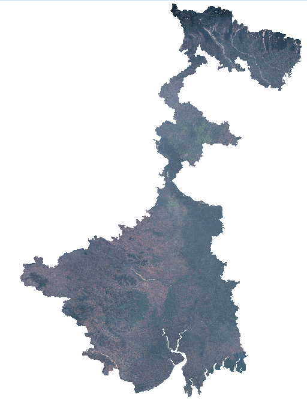

# Automated State-Scale Sentinel-2 Mosaic Generation Using Google Earth Engine and GDAL

## Overview

This project demonstrates an automated workflow for generating high-resolution Sentinel-2 mosaics for an entire Indian state using Google Earth Engine, Python, GDAL, and QGIS. Due to Earth Engine download limitations, the study area was divided into multiple tiles, downloaded in chunks, merged automatically, and mosaicked into a seamless statewide raster.

The workflow was tested on West Bengal and produced a complete 10 m resolution four-band Sentinel-2 mosaic suitable for vegetation analysis, land cover mapping, and geospatial visualization.

**Study Area:** West Bengal, India
**Data Source:** Sentinel-2 Surface Reflectance (COPERNICUS/S2_SR_HARMONIZED)
**Spatial Resolution:** 10 m
**Role:** Solo Project
**Status:** Completed

---

## Methods & Tools

### Data Sources

* Sentinel-2 Surface Reflectance imagery (Google Earth Engine)
* Administrative boundary dataset for West Bengal

### Processing Steps

1. Retrieved Sentinel-2 imagery from Google Earth Engine.
2. Applied cloud filtering and temporal filtering.
3. Generated a median composite image.
4. Divided the study area into download-compatible tiles.
5. Downloaded imagery in multiple chunks due to Earth Engine export limitations.
6. Merged band chunks into multi-band GeoTIFF files using GDAL.
7. Built a statewide virtual raster (VRT).
8. Converted the VRT into a seamless GeoTIFF mosaic.
9. Visualized and validated results in QGIS.

### Tools Used

| Tool                | Purpose                                              |
| ------------------- | ---------------------------------------------------- |
| Google Earth Engine | Satellite image processing and compositing           |
| Python              | Workflow automation                                  |
| Geemap              | Earth Engine image export                            |
| GDAL                | Raster merging, VRT creation, and GeoTIFF generation |
| QGIS                | Visualization and quality assessment                 |

---

## Key Findings

* Successfully generated a complete Sentinel-2 mosaic covering the entire state of West Bengal.
* Automated the download and merging of hundreds of raster tiles using Python.
* Produced a seamless four-band GeoTIFF suitable for further remote sensing analysis.
* Demonstrated an end-to-end workflow from cloud-based image processing to desktop GIS visualization.
* Reduced manual processing requirements through automated tiling and raster assembly.

---

## Technical Highlights

* Automated Earth Engine data acquisition.
* Dynamic tile generation based on study area extent.
* Multi-stage GDAL workflow using BuildVRT and Translate.
* State-scale raster mosaic generation at 10 m resolution.
* Reproducible Python-based geospatial processing pipeline.

---

## Links

[View Code on GitHub](https://github.com/SubSh2004/satellite-imagery-downloader){ .md-button }

[Sentinel-2 Dataset](https://developers.google.com/earth-engine/datasets/catalog/COPERNICUS_S2_SR_HARMONIZED){ .md-button }
